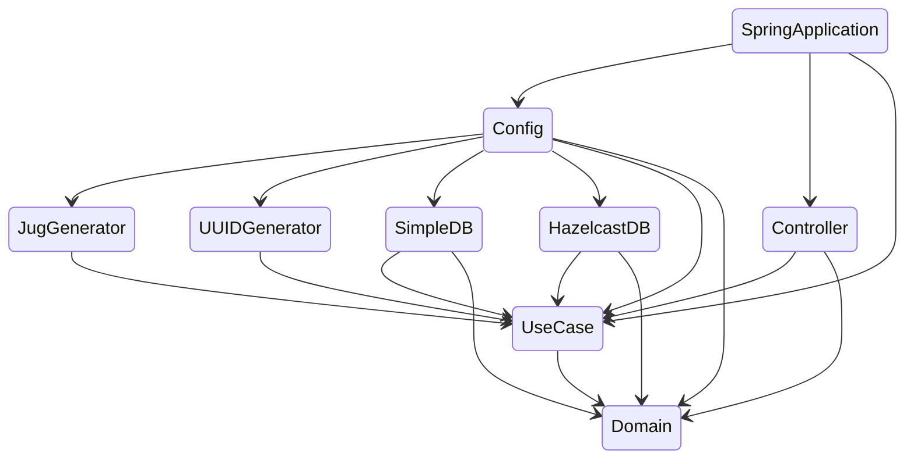

# Clean Architecture Todo Example

## Description

This is a clean architecture implementation of the todo backend. The project uses
[Project Jigsaw](https://openjdk.java.net/projects/jigsaw/) to achieve modularity
between components in the project.

Currently, this project uses spring boot in order to implement the  backend. It
would have been interesting to do another backend implementation in parallel,
but time will not allow that for now. For example using the latest
[Jakarta EE](https://jakarta.ee/compatibility/#tab-9_1) specification or some
implementation of the MicroProfile to compare to the spring boot implementation
and also to ensure that the parts are really modularized could be a fun exercise
for someone that has time for that.

## Module dependencies

The diagram below shows the modules used in this project and how they depend
on each other.




## Pre-requisite

Java 11

```
> java -version
openjdk version "11" 2018-09-25
OpenJDK Runtime Environment 18.9 (build 11+28)
OpenJDK 64-Bit Server VM 18.9 (build 11+28, mixed mode)
```

### Compile

`./gradlew clean build`

### Run Spring example

`java -jar application/spring-app/build/libs/spring-app-1.0.0.jar`


## links

http://localhost:8080/todos
https://todobackend.com/client/index.html
https://todobackend.com/specs/index.html

Running client
https://todobackend.com/client/index.html?http://localhost:8080/todos

Running tests
https://todobackend.com/specs/index.html?http://localhost:8080/todos


## Credits

First a thanks to Uncle Bob and his insights regarding clean architecture.
Please have a look at his [blog](https://blog.cleancoder.com/uncle-bob/2012/08/13/the-clean-architecture.html)
for a more in depth explanation of what the Clean Architecture is all about.

Thank also to Carl-Philipp Harmant for his inspirational blog post on clean
architecture using Java 11. Brian Sayler also needs some credits for his spring-todo
example that was used to look at how a spring implementation of the todo framework
could look like.
